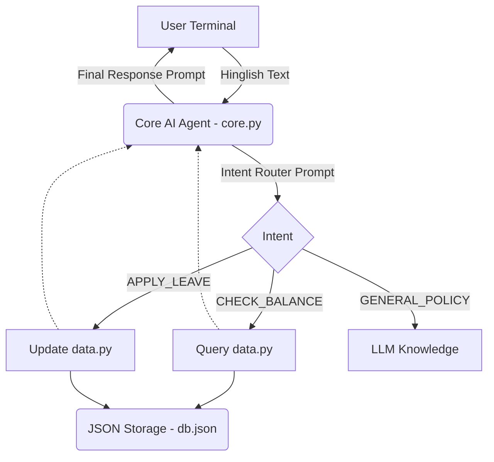

# VoiceHR 

VoiceHR is an AI-powered WhatsApp HR assistant for India's frontline workforce. It allows workers to ask HR questions, check leave balances, and apply for time off using simple Voice Notes in their native regional languages.

## Architecture

## Tech Stack
- **AI Framework:** LangChain (LLMChain)
- **LLM:** Groq (openai/gpt-oss-20b)
- **Data Layer:** Python JSON read/write (`data.py`)
- **UI:** Terminal (WhatsApp integration planned for Phase 5)

## How to run
1. Ensure `.env` has your `GROQ_API_KEY`.
2. Run `python3 src/core.py`.
